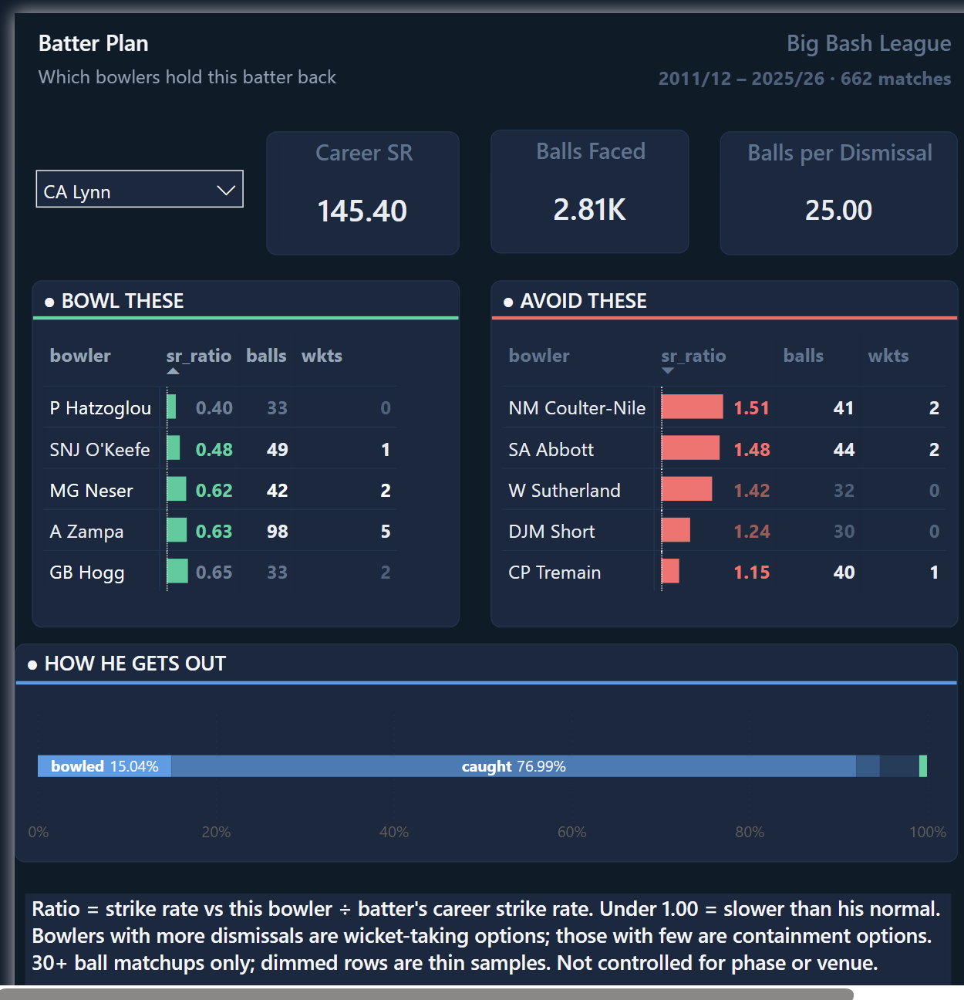
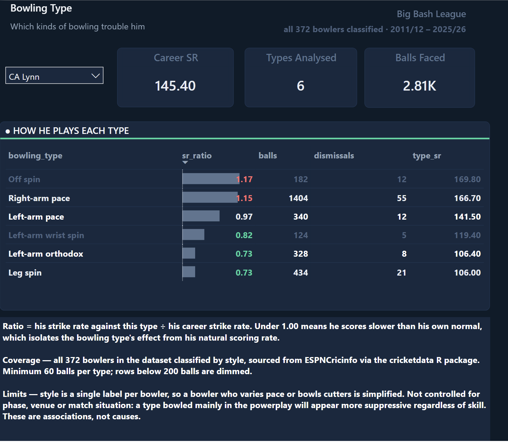
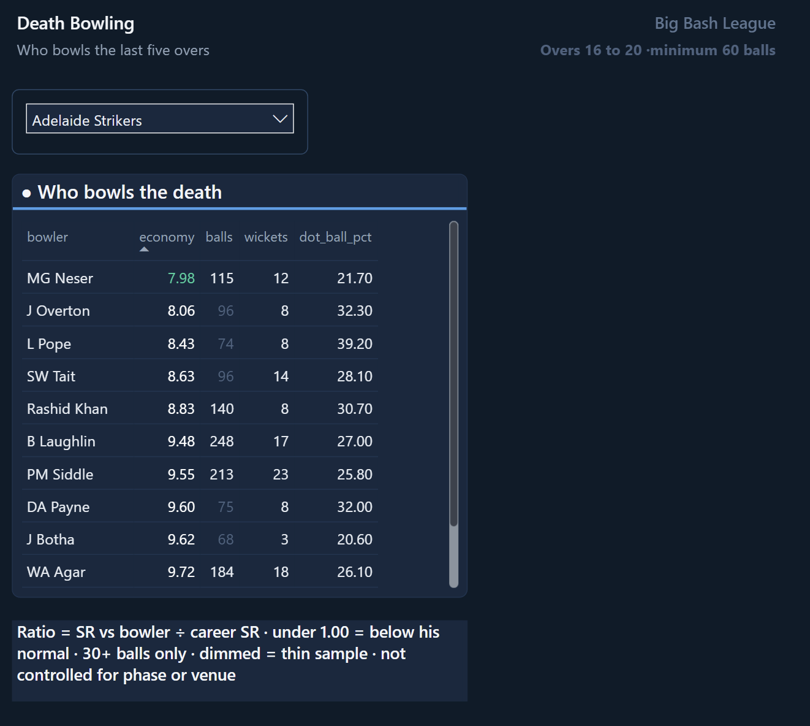

# BBL opposition scouting dashboard

**Chris Lynn cannot play the ball that turns away from him.** Leg spin and left-arm
orthodox hold him 27% below his normal scoring rate. Off spin, also spin but turning the
other way, he hits harder than pace.

That took 153,250 deliveries to find. This is the dashboard that surfaced it.



---

## The dataset

[Cricsheet](https://cricsheet.org) publishes free, structured ball-by-ball cricket records,
maintained by volunteers and released under the Open Data Commons Attribution License.

**One row per delivery.**

| Field | Example |
|---|---|
| `match_id` | 524915 |
| `ball` | 5.3 (over 5, third ball) |
| `striker` / `bowler` | SE Marsh / MG Neser |
| `runs_off_bat` | 4 |
| `wicket_type` | caught |

Each match also ships an `_info.csv` with the squads, venue, toss, and a **player registry**
giving every player a permanent ID that links through to ESPNCricinfo.

### Scope after processing

| | |
|---|---|
| Competition | Big Bash League (men's) |
| Seasons | 2011/12 to 2025/26, fifteen seasons |
| Matches | 662 |
| Deliveries | 153,250 |
| Players | 639, resolved by registry ID |
| Bowlers classified by style | 372, all of them |
| Venues | 32 recorded names, 21 actual grounds |

### What it does not contain

**No player attributes.** No bowling style, no batting hand, no team membership. Verified
by reading a complete info file.

That gap mattered. Knowing a batter struggles against *one bowler* only helps if you have
that bowler. Knowing he struggles against *leg spin* works against anyone. Filling it is
section 6 of the pipeline.

---

## Questions it answers

| | Question | Page |
|---|---|---|
| 1 | Which bowlers hold this batter back, and which does he score freely against? | Batter plan |
| 2 | Is he weak against a *kind* of bowling, such as leg spin or pace? | Bowling type |
| 3 | How does he get out, and to what? | Batter plan |
| 4 | Who should bowl the last five overs? | Death bowling |

The second is the one that travels. *"Bowl Zampa at Lynn"* only helps if you have Zampa.
*"Lynn struggles against leg spin"* works against any opponent.

---

## Stack

- **Python** for ingest, validation and orchestration
- **PostgreSQL** for the star schema and four serving views
- **R** for one step, fetching bowling styles
- **Power BI** for the three-page report

```
  Cricsheet CSV files                662 match files + 662 info files
  ────────────────────                        │
                                              ▼
  ①  bronze_deliveries          raw, untouched · 153,250 rows
                                    ▲ duplication bug caught here
                                              │
                                              ▼
  ②  Star schema                dim_venue      32 names → 21 grounds
                                dim_match      662 matches
                                dim_player     639, by registry ID
                                fact_delivery  one row per ball
                                              │
                                              ▼
  ③  bowler_style               372 bowlers → 6 style groups
      (via R package)                         │
                                              ▼
  ④  Four SQL views             v_scouting        → page 1
                                v_dismissals      → page 1
                                v_bowler_type     → page 2
                                v_death_bowling   → page 3
                                              │
                                              ▼
  ⑤  Power BI                   three pages, one batter slicer

  ── every stage validates itself and halts on failure ──
```

**Why a star schema.** One table of facts surrounded by small reference tables. Nothing is
stored twice, and Power BI is built for this shape.

**Why views rather than logic inside Power BI.** All aggregation lives in SQL, so it stays
readable, testable and version-controlled outside a `.pbix` file. Power BI receives a few
hundred summarised rows instead of 153,250.

---

## Sources

| Source | Used for |
|---|---|
| [Cricsheet BBL](https://cricsheet.org/downloads/) | 662 match files, ball-by-ball |
| [Cricsheet player register](https://cricsheet.org/register/people.csv) | maps Cricsheet IDs to ESPNCricinfo IDs |
| [`cricketdata`](https://github.com/robjhyndman/cricketdata) R package | bowling styles for all 372 bowlers |

---

## Main finding: Chris Lynn

### Turn direction, not spin versus pace

| Bowling type | Ratio | Balls | Wickets |
|---|---|---|---|
| Leg spin | **0.73** | 434 | 21 |
| Left-arm orthodox | **0.73** | 328 | 8 |
| Left-arm wrist spin | 0.82 | 124 | 5 |
| Left-arm pace | 0.97 | 340 | 12 |
| Right-arm pace | **1.15** | 1,404 | 55 |
| Off spin | **1.17** | 182 | 12 |

The obvious reading is *"he struggles against spin."* But **off spin is his best type**,
17% above his normal rate. All three of the extreme entries are spin.

**The difference is which way the ball turns.** Lynn is right-handed. Leg spin and
left-arm orthodox turn *away* from him. Off spin turns *into* him.

**No model would have labelled that.** It needed someone to notice that two of six
categories share a physical property. And it is directly actionable: bowl anything that
turns away from him.

---

## The metric behind it

Every number is a **ratio**, not a raw figure.

**Why.** A batter scores 104 runs per 100 balls against a particular bowler. Is that good
bowling? You cannot tell. It depends how fast that batter normally scores.

```
sr_ratio  =  strike rate against this bowler  ÷  his own career strike rate

strike rate  =  ( runs ÷ balls faced ) × 100
```

**Worked example: Lynn against Adam Zampa**

| Step | Calculation | Result |
|---|---|---|
| Career record | 4,088 runs off 2,812 balls | |
| Career strike rate | (4,088 ÷ 2,812) × 100 | **145.4** |
| Against Zampa | 104 runs off 98 balls | |
| Strike rate vs Zampa | (104 ÷ 98) × 100 | **106.0** |
| **Ratio** | **106.0 ÷ 145.4** | **0.73** |

**Lynn scores 27% slower against Zampa than he does normally.**

| Value | Meaning |
|---|---|
| **0.73** | 27% slower than his own normal, the bowler has the edge |
| **1.00** | no effect |
| **1.15** | 15% faster than his normal, the batter has the edge |

The ratio **isolates the bowler's effect from the batter's natural style**. A raw strike
rate of 104 could be a bowler containing an aggressive batter, or an ordinary day for a
defensive one.

Two further ratios, `dot_ratio` and `boundary_ratio`, show *how* a bowler contains a
batter: by denying singles, or by denying boundaries. Different field settings.

---

## The dashboard

### 1 · Batter plan

Which bowlers hold this batter back, and which he attacks. Ball counts on every row, with
thin samples visibly dimmed so weak evidence looks weak. A dismissal breakdown underneath,
which drives field settings.


### 2 · Bowling type

The same question one level up, and where the finding above came from. It also multiplies
the evidence: one pairing is 30 to 90 balls, a bowling type is 400 or more.



### 3 · Death bowling

Economy in overs 16 to 20, with dot-ball percentage. Who to trust when the game is on the
line.



---

## Validation

**43 checks, all passing.** The pipeline halts if any fails, so bad data cannot reach the
dashboard.

- **Completeness.** Row counts match between stages, all 662 matches survive, no duplicates
- **Referential integrity.** Every ball links to a real match, batter and bowler
- **Join safety.** No player name maps to two IDs, which would silently duplicate rows
- **Validity.** Runs per ball between 0 and 6, no nulls in key fields, no team playing itself
- **Domain reality.** About 240 balls per match, exactly 8 BBL teams, pace-dominated bowling mix
- **External.** Chris Lynn's strike rate computes to 145.4, matching his published record

### Why the last two groups exist

Partway through the build, every ball was being loaded twice. Cricsheet ships
`all_matches.csv` alongside the 662 individual files, and it contains every delivery
already in them.

**Nothing errored.** Strike rate is runs divided by balls, so doubling both cancels out.

> **The validation passed because both sides were doubled.**

Raw and fact tables agreed at 306,500 rows each. They agreed because both were wrong.

> **A T20 match is 240 balls. The data said 463.**

Comparing one stage of a pipeline to another **cannot catch an error present at every
stage**. Every stage now carries a check against the outside world as well.

Full validation approach in [`METHODOLOGY.md`](METHODOLOGY.md), including how each check
was chosen and the two that had to be tuned after they fired on legitimate cricket.

---

## Limitations

**Phase, tested rather than assumed.** A bowler used mainly in the powerplay looks more
suppressive regardless of skill. The obvious fix is to compare each matchup against the
batter's baseline for that phase. Measured:

| Phase | Matchups surviving | Batters |
|---|---|---|
| Middle | 109 | 40 |
| Powerplay | 73 | 29 |
| **Death** | **6** | **5** |

> **188 matchups instead of 620, so the confound is named, not fixed.**

The correction exists, it was tried, and the data lacks the depth for it. **These are
associations, not causes.**

**Small samples.** T20 head-to-head records rarely exceed sixty balls. At the thirty-ball
threshold a pairing is indicative, not conclusive. No significance testing applied.

**Style is one label per bowler.** Someone who varies pace or bowls cutters is simplified.

**Coverage.** Only batters with 500+ career balls get a baseline, so the analysis describes
established players and says nothing about emerging or lower-order ones.

Full list in [`METHODOLOGY.md`](METHODOLOGY.md) §9, alongside what a project like this
cannot replicate.

---

## Repository contents

| File | |
|---|---|
| [`bbl_scouting_pipeline_final.ipynb`](bbl_scouting_pipeline_final.ipynb) | the pipeline, with outputs, 43 checks all passing |
| [`METHODOLOGY.md`](METHODOLOGY.md) | every decision and why, setup instructions, full limitations |
| `bbl_dark_theme.json` | the Power BI theme |
| `fetch_styles.R` | fetches bowling styles, generated by the notebook |
| `screenshots/` | the three dashboard pages |

**The notebook reads on GitHub without running anything.** Outputs are saved, so the
validation results and result tables show inline.

**To run it yourself**, see [`METHODOLOGY.md`](METHODOLOGY.md) for data sources, connection
setup and the R step.

---

## Next

**Women's Big Bash.** The pipeline is competition-agnostic. WBBL uses the identical
Cricsheet format, so pointing the loader at it is a data swap rather than a rebuild. That
reusability was the design goal.

**Significance testing** on the matchup ratios, so a 0.73 over 434 balls can be
distinguished from a 0.73 over 60.

---

Data from [Cricsheet](https://cricsheet.org) under the Open Data Commons Attribution
License. Bowling styles via the
[cricketdata](https://github.com/robjhyndman/cricketdata) R package by Rob Hyndman.
